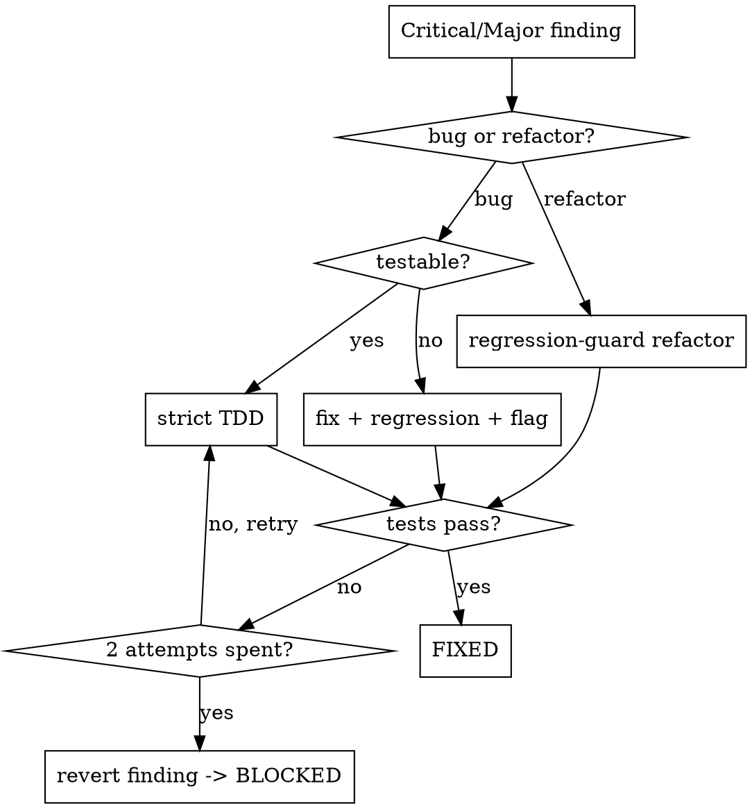

# Review Loop

Run three independent reviewers over the branch diff in parallel, dedup their findings, then fix every **Critical** and **Major** under TDD. Re-review and repeat until a clean round or the cap.

Be ambitious. Hunt hard, triage honestly, fix decisively. Don't stop while a real Critical or Major remains. A finding is "fixed" only when test output proves it, and a confirmed Critical/Major is never silently dropped.

Like `prime`, this skill drives other skills. Reviewers: `superpowers:requesting-code-review` (correctness), `claude-team-kit:thermo-nuclear-code-quality-review` (maintainability), `code-review` (normal). After the loop, `comment-minimization` runs once as a final cleanup pass — **not** a fourth reviewer: no findings, no triage, just comment stripping.

## Startup

Invoke `honest-completion-claims` first. Every "fixed/passing/clean" claim must cite real test output — not exit codes, not a subagent's verdict.

## 0. Target

```bash
DEFAULT_BRANCH=$(git symbolic-ref refs/remotes/origin/HEAD | sed 's@^refs/remotes/origin/@@')   # never hardcode master
BASE=$(git merge-base origin/"$DEFAULT_BRANCH" HEAD)
HEAD=$(git rev-parse HEAD)
```

Reviewers diff `BASE..HEAD` (committed). Each iteration commits its fixes (step 5), so the diff grows and every round sees prior work — that is what makes the loop converge.

Abort and report (don't loop) if the branch is the default branch or `BASE..HEAD` is empty.

## 1. Review — three reviewers, one parallel message

Each subagent runs its review, then reformats its output into the schema below. Raw reviewer prose must not reach triage.

| Reviewer | Dispatch |
|----------|----------|
| R1 correctness | `Agent` (general-purpose), prompt = filled-in `requesting-code-review/code-reviewer.md` template (set `BASE_SHA`/`HEAD_SHA`). Embed the template — don't invoke that skill inside the subagent; it's a dispatcher and nesting fails. |
| R2 maintainability | `Agent`, `agentType: claude-team-kit:thermo-nuclear-code-quality-review`. |
| R3 normal | `Agent` (general-purpose) invoking the `code-review` skill over `BASE..HEAD`. |

Each returns a JSON array of:

```json
{ "source":"R1|R2|R3", "file":"path", "line":123,
  "severity":"critical|major|minor", "category":"bug|refactor",
  "desc":"", "suggested_fix":"", "testable":true }
```

Severity mapping: R1/R3 Critical→critical, Important→major, Minor→minor. R2 presumptive-blocker→major, lesser→minor. Refactors may lack a `line` but must name a target.

## 2. Dedup + triage

Merge all three. Dedup by (file, ~line, semantic overlap); keep the highest severity, union the fixes. Re-apply the rubric yourself — don't trust reviewer labels:

- **critical** — correctness bug, security, data-loss, broken behavior or invariant.
- **major** — architecture problems, missing requirements, poor error handling, test gaps, and *severe* maintainability (file pushed past ~1000 lines, new spaghetti branching, feature logic leaking into shared paths).
- **minor** — everything else; deferred to the report.

Fix **critical + major** only.

## 3. Fix each Critical/Major



- **bug + testable** → strict TDD: write a test that reproduces it, watch it fail, fix, watch it pass.
- **bug + untestable** (heavy AWS/Cognito/dbUtils mocking) → try a test first; if truly infeasible, fix anyway, run the full stack suite as a regression guard, flag **FIXED — manual verification needed**. Never skip a confirmed Critical/Major.
- **refactor** → regression-guard: suite green before → refactor → same suite green after. No new test.
- **blocked** → if a fix won't pass after **2 attempts**, revert only that finding's changes, mark **BLOCKED**, move on.

## 4. Tests

Detect the affected stack from changed paths (`noraev3/`, `live-stream/`, `adminv4/`, …) and run that stack's Jest. Tests are per-stack — no root `tests/unit`. If you can't locate or run the suite, stop and say so — never treat "no tests ran" as green.

## 5. Commit (per iteration)

One commit per round on the current branch:

```
fix(review): iter N — <findings fixed>
```

Blocked findings are reverted, so they never land. The next round's `BASE..HEAD` now includes this commit.

## 6. Loop / stop

After committing a round's fixes, return to step 1 and re-dispatch all three reviewers on the new diff. Never re-judge the old findings list — a fix is confirmed gone only by a fresh review. Exit when a full fresh round finds **0 critical/major**, or after **5 iterations** (override with a numeric arg, e.g. `/review-loop 3`). Hitting the cap is a reported outcome, not a failure to hide.

## 6.5 Final comment cleanup

Loop exited (clean, capped, or BLOCKED still open) → run `comment-minimization` once over the whole branch:

```bash
git diff --name-only "$BASE"..HEAD   # files to clean
```

Invoke it on that list; its own "do not over-apply" rules cover non-code files (markdown, CFN/OpenAPI `Description:`) — don't pre-filter.

Then guard the cleanup — comment removal *should* be behaviour-preserving but isn't guaranteed (stripping a pragma like `eslint-disable` / `@ts-ignore` / `noqa` changes lint/build):

- Run **every** stack the diff touched (`noraev3/`, `live-stream/`, `adminv4/`, …), not just step 4's single stack. Same no-tests-ran rule as step 4 — can't run a suite, say so, never green.
- A suite goes red → revert only that stack's comment edits (keep all fixes), flag it.

Commit separately so it stays isolated in history:

```
chore(review): minimize comments
```

Nothing removed or trimmed → skip the commit, say so.

## 7. Report

Five distinct buckets so a capped run never reads as all-clean:

- **FIXED** — how verified (test name, or full-suite regression).
- **FIXED — manual verification needed** — untestable bugs fixed.
- **BLOCKED** — why the fix couldn't be verified.
- **DEFERRED (minor)**.
- **COMMENTS** — the cleanup tally: deleted N / trimmed M / kept K, and any stack whose suite was reverted.

State iterations used and whether exit was **clean** or **hit cap**.

## Common mistakes

- Nesting `requesting-code-review` in a subagent — embed its template instead.
- Skipping a confirmed Critical/Major for lack of a test — forbidden; fix + regression + flag.
- Treating a green exit code or "no tests ran" as proof — only real suite output counts.
- Leaving fixes uncommitted between rounds — the next review won't see them, the loop won't converge.
- Trusting reviewer severity labels — re-triage against the rubric.
- Re-judging the stale findings list instead of re-dispatching reviewers — only a fresh review confirms a fix landed.
